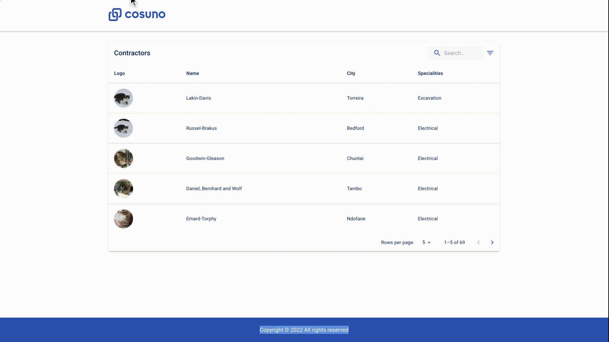
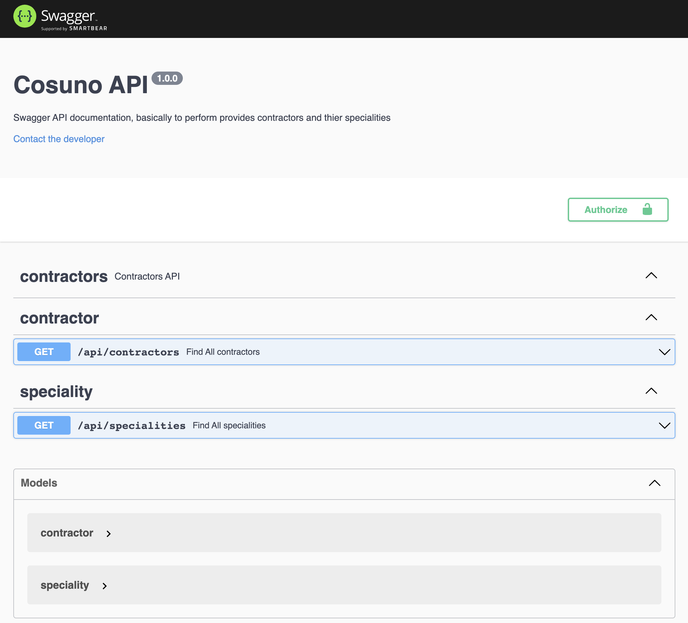

# Cosuno APP

> This App provides an interface to view the list of contractors and their specialization and perform search and filter on them.

> It's implemented using React, Material UI Library and React Context API for state management as it is very trivial application. It has very potentail in future when it's fully implemented with all the routing and backend Api's.

<p align="center">
    <a href="https://cosuno-app.netlify.app/" target="blank">Demo</a>
</p>

<p align="center"></p>

<p align="center">
    <a href="https://cosuno-api.herokuapp.com/" target="blank">API Demo</a>
</p>

<p align="center"></p>

## Technologies

#### Backend

> - [Node.js](https://nodejs.org/)
> - [Express.js](https://expressjs.com/)
> - [Typescript](https://www.typescriptlang.org/)

#### Frontend

> - [React JS](https://reactjs.org/)
> - [Context API](https://reactjs.org/docs/context.html)
> - [Typescript](https://www.typescriptlang.org/)
> - [Material UI Library](https://mui.com/)

## Installation Steps

> For detail installation steps please check the sub folders [client](/client/README.md) and [server](/server/README.md) respectively.

> Please before run the app, take into account to have a node.js installed in your system locally.

1. Clone the repository

```bash
git clone https://github.com/ravisankarchinnam/cosuno-app.git
```

2. Install dependencies

```bash
cd client && yarn install
cd server && yarn install
```

3. Run the app concurrently

```bash
yarn start
```

### Enhancements

> - Write unit tests & cypress test
> - Configure better linters and pre commit hooks(husky)
> - dockerize the Application

#### Frontend

1. Server size rendered using Next.js
2. Implement Redux project in increase size
3. Search based on city, and other properties
4. Interface to CRUD contractor
5. Interface to CRUD specialization
6. Create Login/Register
7. Implement Bidding system intefaces
8. Implement Favorites list.
9. I18N for multiple languages

#### Backend

1. Integrate API with real database.
2. Implement Search Features (limit, sort, pagination, etc.)
3. Implement Session management
4. Implement CRUD Operations for Contractors
5. Implement CRUD operations for specialities
6. Implement Bidding system API

## Author

> Ravisankar Chinnam
