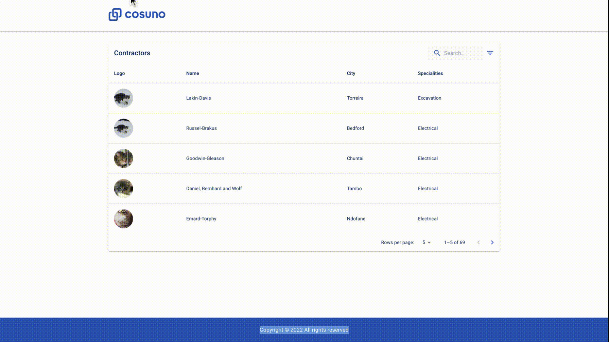

# Cosuno APP

> This App provides an interface to view the list of contractors and their specialization and perform search and filter on them.

> It's implemented using React, Material UI Library and React Context API for state management as it is very trivial application. It has very potentail in future when it's fully implemented with all the routing and backend Api's.

<p align="center"></p>

<p align="center">
    <a href="https://cosuno-api.herokuapp.com/" target="blank">API Demo</a>
</p>

## Libraries

> - [React JS](https://reactjs.org/)
> - [Context API](https://reactjs.org/docs/context.html)
> - [Typescript](https://www.typescriptlang.org/)
> - [Material UI Library](https://mui.com/)

## Features

> - View the list of contractors and thier details
> - Search for a company by typing into the search field
> - Search results are filtered based on the company name in real time
> - Filter the list by specialization by checkboxes.

## Installation Steps

> Please before run the app, take into account to have a node.js installed in your system locally

1. Clone the repository

```bash
git clone https://github.com/ravisankarchinnam/cosuno-app.git
```

2. Change the working directory

```bash
cd client
```

3. Install dependencies

```bash
yarn install
```

4. Create `.env` file in root and add your variables

```bash
REACT_APP_API_URL=YOUR_BACKEND_API_BASE_URL
```

5. Run the app

```bash
yarn start
```

> You are all set! Open [localhost:3000](http://localhost:3000/) to see the app.

> `yarn run build` - which generates a build folder with all the files ready for the deployment in the same `client` folder.

## Deployment

> This API is deployed to netlify, please use this link to access the site [https://cosuno-app.netlify.app](https://cosuno-app.netlify.app)

## Enhancements

1. Server size rendered using Next.js
2. Implement Redux project in increase size
3. Search based on city, and other properties
4. Interface to CRUD contractor
5. Interface to CRUD specialization
6. Create Login/Register
7. Implement Bidding system intefaces
8. Implement Favorites list.
9. I18N for multiple languages
10. Lot more possibilities...

## Author

> Ravisankar Chinnam
